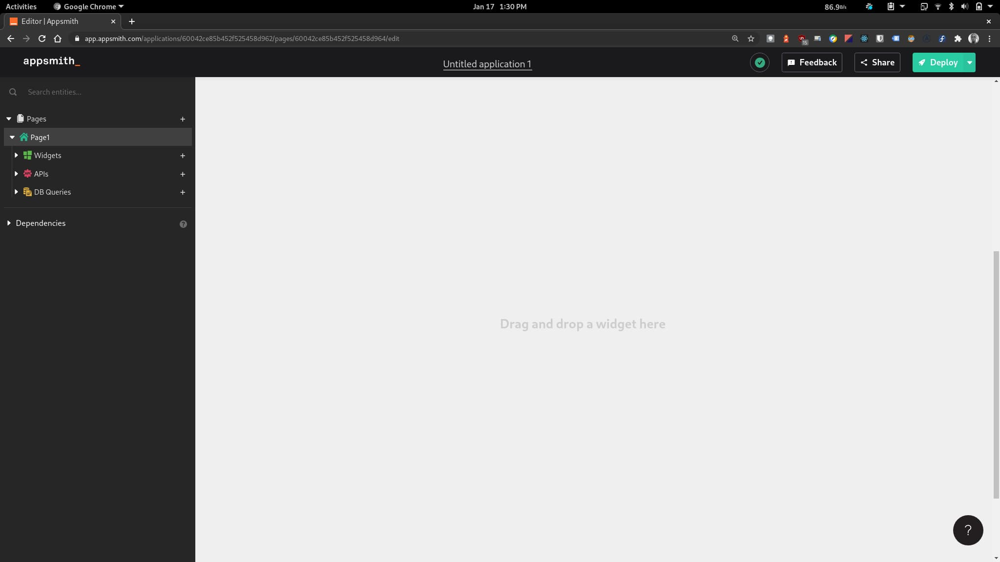
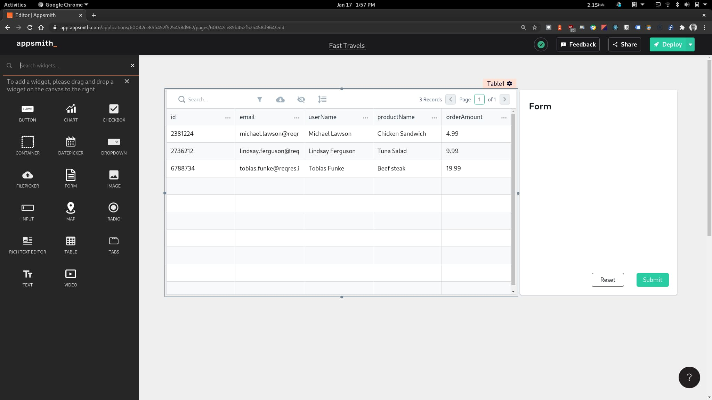
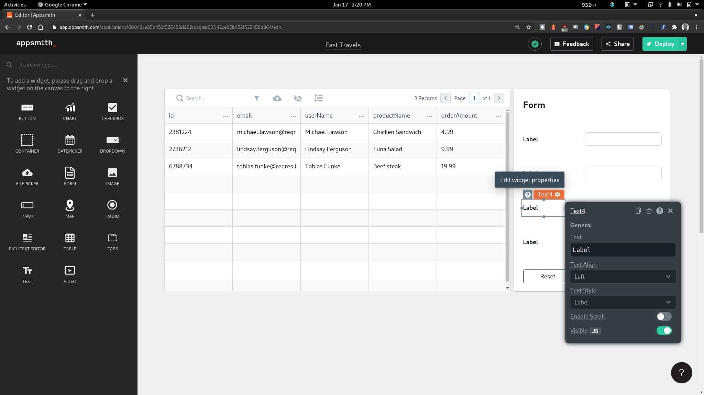
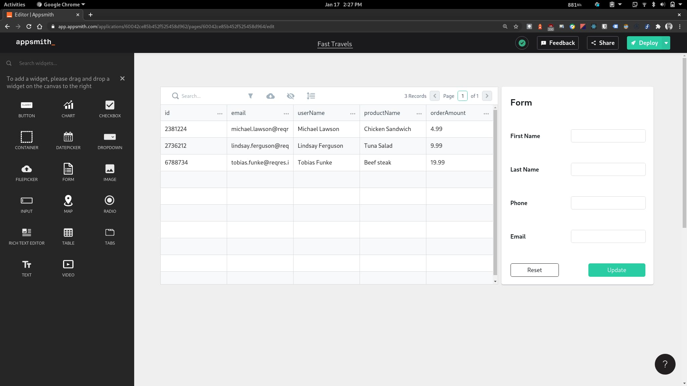
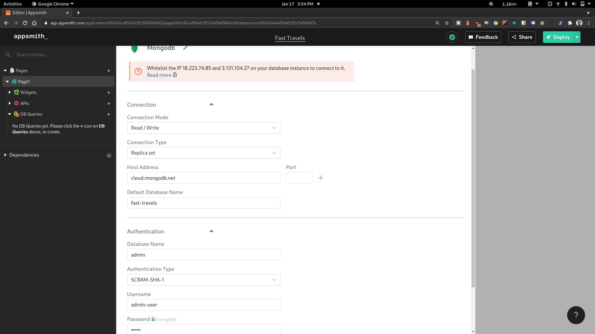
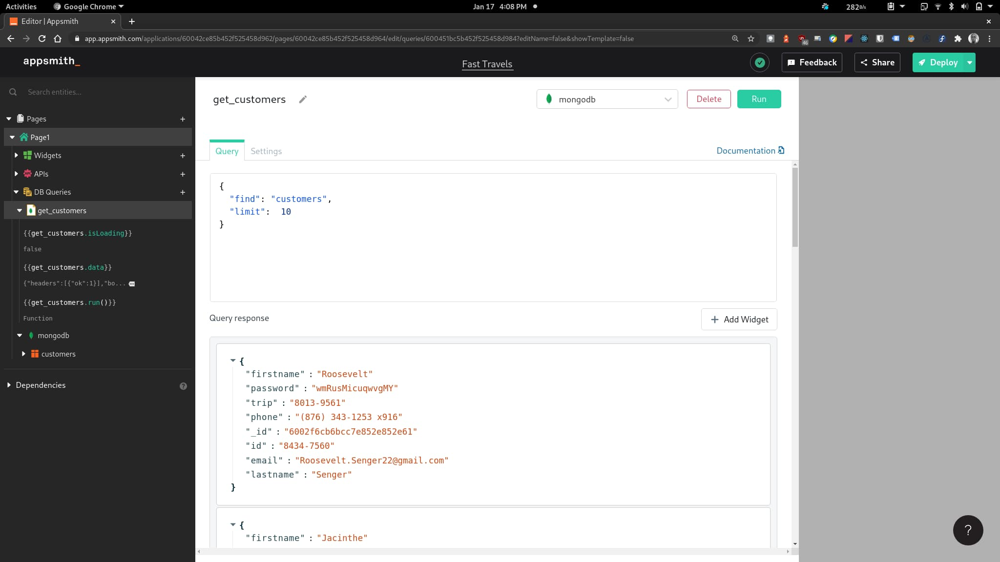

# Appsmith

## Intro

About two weeks ago I discovered a really awesome tool. I wanted to build an internal tool for one of my side projects, but delayed a lot because of the stress of building everything from scratch. I already knew about `Retool` (we use it a work), but didn't reach for it because it was quite expensive. A miracle happened and I came across [this article](https://dev.to/fayaz/a-list-of-actually-useful-nocode-tools-and-i-am-not-talking-about-site-builders-3m4g) by @fayazara. Since then I've fallen in love with `Appsmith`

In these article series, I will show you how you can build awesome internal tools for your company or any side project you may be working on. We will be building an internal dashboard for a transportation startup called _Fast Travels_.

Here's a mini map to help you out

1. article title (you are here)
2. article title
3. article title

## Setting up the UI

Go ahead and sign up for Appsmith and click on the 'Create New' button on your dashboard to create an new app. You should be taken to the app dashboard (shown in image below) where we can start build our app.



To the left of the dashboard, we have an explorer similar to that on `VScode` where we can add pages as well as widgets and link up apis and databases to our app. The first page we are going to build in our app would be the customer management dashboard which will allow us to view customer info and update it as needed. We will need two widgets to make this happen, first a table to view customers data and a form to update the users information. Appsmith's got us covered, head over to the widgets section on the explorer and you'll see. We can drag over a table and form widget and nicely arrange them on the page as shown bellow.



While still on the widgets section, set's drag in some input and text widgets to the form. The text widgets will serve as labels for our inputs.



Appsmith make is really easy to configure all widgets by providing a configuration menu that can be used to tweak the properties or behaviors of a widget. An example is shown in the picture above. Let's use this to rename all the text widget in our form to properly label each input. We'd be having something looking like this when done



## Connecting to a data source

Here comes the fun bit and that's linking up our UI with actual data. Appsmith provides us with a host of options to connect data to our app. On one hand we can connect directly to our database, eliminating the need to build an api over our database. How cool is that! Appsmith supports a slew of databases including PostgreSQL, MongoDB, Mysql, ElasticSearch, DynamoDB, Redis, MsSQL and Firestore. On the other hand, we can pull in data from an already existing api and this allow for endless customization.

For the sake of our app, we would be connecting directly with to a hosted MongoDB instance on MongoDB Atlas. To do this, click on the plus icon on 'DB Queries', then click on the 'New Datasource' button on the slide in page and then select mongodb.

Configuring a data source is fairly easy as show in the image below. All we need to do is give this data source a name and go on to configure the host address, post, default database name, auth username and password. And we're done!



We can now go ahead to query the database. To do this click on the plus icon on 'DB Queries' and you should see our newly added MongoDB data source showing on the slide-in page. Click on the 'New Query' button close to it and we're golden. One the following page we can give our query a name and select a 'Read' template from the list. Here's a simple query to fetch customers directly from the database (don't forget to hit the 'Run' button).



Now we can go back and to our customers table and make use of the data returned form our `get_customers` query. Now the power of Appsmith begins to shine as show in the gif below


Appsmith supports the Mustache syntax and allow us to write Javascript. Auto-complete is also supported just as in VScode. This make is easy to write custom logic in various parts of our app.

And just like that we have data from our database linked up with our customers table. We also have the option to hide a field that we do not want showing up on the table (i.e passwords) by clicking on the menu icon on that column

## Updating a customer

Next, let's make it such that the data of the selected customer on the table would automatically pre-fill the inputs on the form. This is possible because Appsmith allows us to hook to the state of a widget. Let's take `First Name` as an example. To get the first name of the customer selected on the table to auto fill the First Name input widget, we'll need to set the `Default Text` value of the input widget to

```js
{
  {
    Table1.selectedRow.firstname;
  }
}
```

Where `Table1` is the name of our table widget (this is the default generated name and can be renamed). Go ahead and do the same of all the other input widget. Then see the magic happen in the gif below


Lastly, we need to write an `update_customer` query and make it run when the update button on the form is clicked. The query should dynamically fetch data from the input widgets and should look like this

```json
{
  "update": "customers",
  "updates": [
    {
      "q": {
        "id": "{{Table1.selectedRow.id}}"
      },
      "u": {
        "$set": {
          "firstname": "{{ Input1.text }}",
          "lastname": "{{ Input2.text }}",
          "phone": "{{ Input3.text }}",
          "email": "{{ Input4.text }}"
        }
      }
    }
  ]
}
```

Now let's make the Update button run `update_customer` query. To do this, open the customization menu for the widget and under `Actions` `onClick` select `Execute a DB Query` and then select our `update_customer` query. We will also like to call the `get_customers` query once our update query is completed. We're done!


