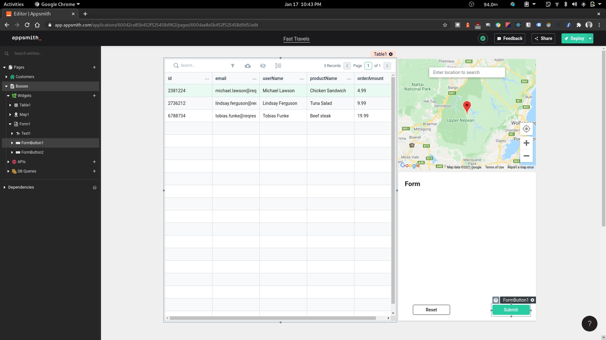
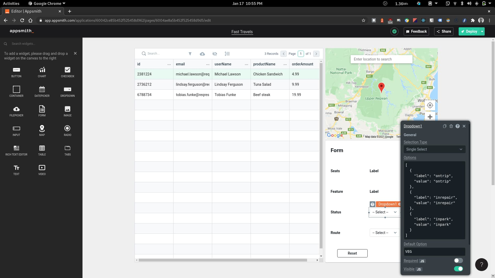
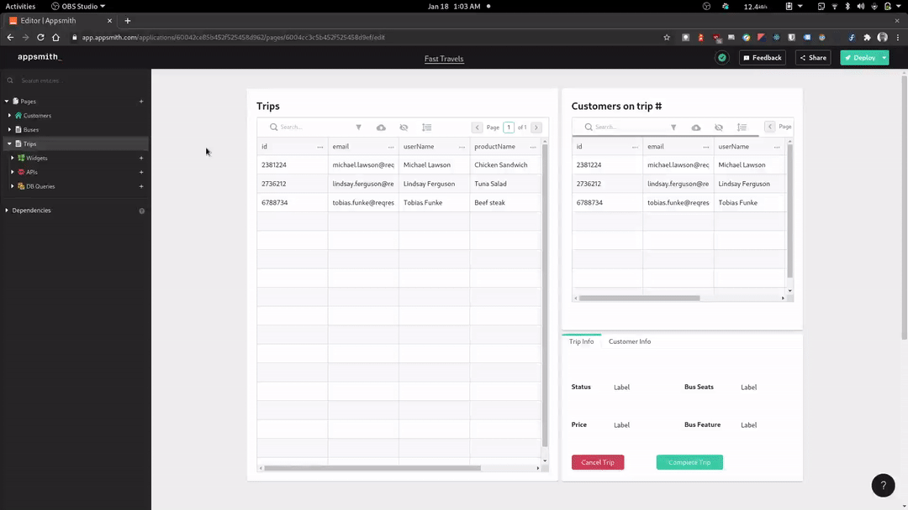
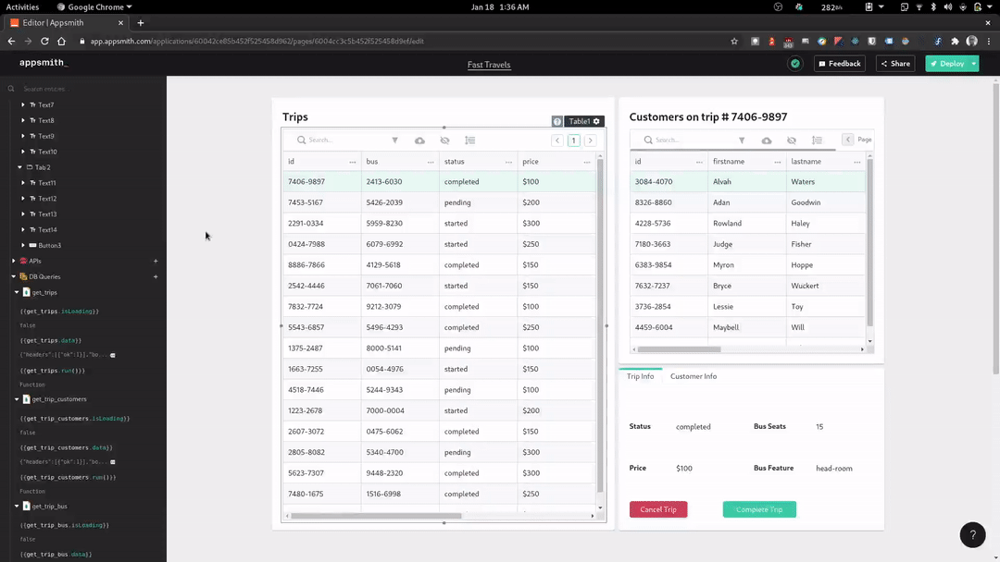
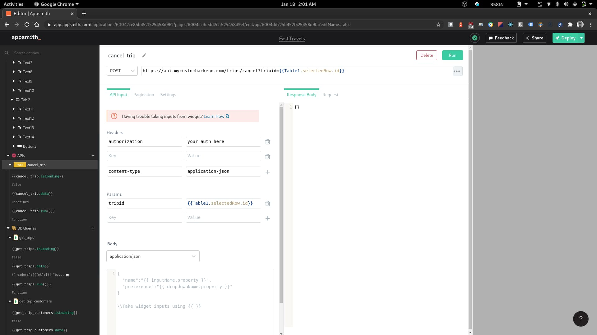

## Intro

About two weeks ago I discovered a really awesome tool. I wanted to build an internal tool for one of my side projects, but delayed a lot because of the stress of building everything from scratch. I already knew about `Retool` (I use it a work), but didn't reach for it because it was quite expensive. A miracle happened and I came across [this article](https://dev.to/fayaz/a-list-of-actually-useful-nocode-tools-and-i-am-not-talking-about-site-builders-3m4g). Since then I've fallen in love with `Appsmith`

In these article, I will show you how you can build awesome internal tools for your company or any side project you may be working on. We will be building an internal dashboard for a transportation startup called _Fast Travels_.

Here's what we are going to be building:

1. Customer management dashboard
2. Buses information board, and
3. Trip management (for refunds, etc)

## 1. Customer management dashboard

### Setting up the UI

Go ahead and sign up for Appsmith and click on the 'Create New' button on your dashboard to create an new app. You should be taken to the app dashboard (would be blank) where we can start build our app.


To the left of the dashboard, we have an explorer side bar, similar to that on `VScode` where we can add pages as well as widgets and link up apis and databases to our app. The first page we are going to build in our app would be the customer management dashboard which will allow us to view customer info and update it as needed. We will need two main widgets on this page, first a table to view customers data and a form to update the customer's information. Appsmith's got us covered, head over to the widgets section on the explorer and you'll see. We can drag over a table and form widget and nicely arrange them on the page as shown bellow.


While still on the widgets section, set's drag in some input and text widgets into the form. The text widgets will be used as labels for our inputs.


Appsmith makes it really easy to configure any widgets by providing a configuration menu that can be used to tweak the properties or behavior of any widget. An example is shown in the picture above. Let's use this to rename all the text widget in our form to properly label each input. We'd be having something looking like this when done


### Connecting to a data source

Here comes the fun bit and that's linking data to our UI. Appsmith provides us with a host of options to connect data to our app. On one hand we can connect directly to a database, eliminating the need to build an api layer over our database. How cool is that! Appsmith supports a slew of databases including PostgreSQL, MongoDB, Mysql, ElasticSearch, DynamoDB, Redis, MsSQL and Firestore. On the other hand, we can pull in data from an already existing api, thus providing infinite customization options.

For the sake of our app, we would be connecting directly with to a hosted MongoDB instance. To do this, click on the plus icon on 'DB Queries', then click on the 'New Datasource' button on the slide in page and then select mongodb.

Configuring a data source is fairly easy as show in the image below. All we need to do is give this data source a name and go on to configure the host address, post, default database name, and authentication. And we're set!


We can now go ahead to query the database. To do this click on the plus icon on 'DB Queries' and you should see our newly added MongoDB data source showing on the slide-in page. Click on the 'New Query' button close to it and we're golden. On the next page, we can give our query a name and select a 'Read' template from the list. Here's a simple query to fetch customers directly from the database (don't forget to hit the 'Run' button).


Now we can go back and to our customers table and make use of the data returned form our `get_customers` query. Now the power of Appsmith begins to shine as shown below


Appsmith supports the Mustache syntax and allow us to write Javascript expressions. Auto-complete is also supported just like in VScode. This make is easy to write custom logic in various parts of our app pretty quickly.

And just like that we have data from our database linked up with our customers table. We also have the option to hide a column that we do not want showing up on the table (i.e passwords) by clicking on the menu icon on that column.

### Updating a customer

Next, let's make it such that the data of the selected customer on the table would automatically pre-fill the inputs on the form. This is possible because Appsmith allows us to hook to the state of a widget. Let's take `First Name` as an example. To get the first name of the customer selected on the table to auto fill the First Name input widget, we'll need to set the 'Default Text' value of the input widget to

```js
{
  {
    Table1.selectedRow.firstname;
  }
}
```

Where `Table1` is the name of our table widget (this is the default name and can be easily renamed). Go ahead and do the same for all the other input widget. Then see the magic happen.


Lastly, we need to write an `update_customer` query and make it run when the update button on the form is clicked. The query should dynamically fetch data from the input widgets and should look like this

```json
{
  "update": "customers",
  "updates": [
    {
      "q": {
        "id": "{{Table1.selectedRow.id}}"
      },
      "u": {
        "$set": {
          "firstname": "{{ Input1.text }}",
          "lastname": "{{ Input2.text }}",
          "phone": "{{ Input3.text }}",
          "email": "{{ Input4.text }}"
        }
      }
    }
  ]
}
```

Now let's make the Update button run our `update_customer` query. To do this, open the customization menu for the widget and under 'Actions' > 'onClick' select 'Execute a DB Query' and then select the `update_customer` query. We will also like to call the `get_customers` query once our update query is successful. and that's it, we have the customer widget ready.


## 2. Creating a bus management dashboard

In this section, we are going to be adding another page to our application that would display the information of the buses we have, visualize their current location and give us the functionality to update them.

### UI setup

Appsmith has another really handy and yet unique feature called 'Pages', that as the name implies allows us to create multiple pages in our app. So let's go ahead and create a 'Buses' page that will house all the UI and logic that is needed to manage a bus. To create a new page, click on the plus icon on the 'Pages' section of the explorer. Rename the page to 'Buses' and then drag in a table, a map and a form widget into the page. We should have something like this when done



Let us go ahead and add text labels and dropdowns to our form like we did previously on the customers page by using the text and dropdown widget. The dropdown widget allows us to pass in an array of items that would be shown as selectable options. We are now going to update our labels and the dropdowns accordingly as shown below.



And now we have a the basic UI of our buses dashboard completed.

### Pulling Data

We need to update the table with real bus data. To do this, let's head off to the 'DB Queries' section on the explorer and create a query to get buses. Let's call this query `get_buses`. Appsmith allows us to do server-side pagination on tables which makes it very easy to display large dataset in small chunks. To set this up we will need to add a skip property to our query and make a dynamic offset calculation using the tables page number as shown below. Then link the data to the table and enable server-side pagination on the table as well as call our query again 'onPageChange'.

```json
{
  "find": "buses",
  "skip": {{(Table1.pageNo - 1)*18}},
  "limit":  18
}
```


Next, let's setup the map to display the current location of the selected bus on the table. To do this, we set the 'Initial location' and 'Default markers' section of the map widget to be the longitude and latitude of the currently selected row on the table and then let Appsmith work it's magic!


Selecting a row now automatically updates the map widget. Sweet!

### Updating a Bus

The last thing we want to do is to update the status and route of a bus. To make this work, we need to write an `update_bus` query that would get data from the form and make the updates accordingly when the Update button is clicked. Here's a sample update query

```json
{
  "update": "buses",
  "updates": [
    {
      "q": {
        "id": "{{Table1.selectedRow.id}}"
      },
      "u": {
        "$set": {
          "status": "{{ Dropdown1.selectedOptionValue }}",
          "route": "{{ Dropdown2.selectedOptionValue }}"
        }
      }
    }
  ]
}
```

Now let's see everything in action


And just like that we have the customer and buses dashboard setup. Let's move on to the last piece.

## 3. Trips management dashboard

In this last section we are going add a page to manage trips. So let's go ahead and make a page called 'Trips'. The UI will be quite simple. It will contain a paginated table showing all trips, a table showing customers on a selected trip and a tab showing both trp info and customer info and also refund and cancel buttons



As you may have noticed, we are going to be making use of two new widgets: the container widget and tab widget. The container widget allows us to group several widgets together. It is also useful for creating titled segments on a page as we did above. Next, we have the tab widget that similarly let's us group several widgets together into tabs. The beauty of the tab widget is that we can neatly hide widgets that are not needed in the moment as only the selected tab is visible.

Now, let's linkup data to our tables. We'd need a query to get trips, one to get the bus assigned, and another to get the customers on a particular trip. Let's name our query to get trips `get_trips` and it should look like this.

```json
{
  "find": "trips",
  "skip": {{(Table1.pageNo - 1)*17}},
  "limit":  17
}
```

We would call the query to get the bus assigned to a trip `get_trip_bus` and it should look like this

```json
{
  "find": "busses",
  "filter": {
    "id": "{{ Table1.selectedRow.bus }}"
  },
  "limit": 1
}
```

And lastly the query to get all the customers on a trip, called `get_trip_customers` should be

```json
{
  "find": "customers",
  "filter": {
    "trip": "{{Table1.selectedRow.id}}"
  },
  "limit": 10
}
```

Now let's go back to our widgets and feed them the data. The trips table should be linked with data from the `get_trips` query. Server-side pagination should be enabled on the table and the query should be re-run 'onPageChange'. We should make sure that the `get_trip_customers` query is run 'onRowSelected' and the `get_trip_bus` query is run 'onSuccess'. Then let's go ahead to link to customers table to the data from the `get_trip_customers` query, and then do the same for the other widgets with their respective data source.

Our Trips dashboard will work as shown below.



We would now go ahead to create actions for our cancel button. We want an api endpoint called `cancel_tip` to be run. Typically, endpoint such as these would be hooked up to Stripe to perform the refunds and have emails send out to customers using a service like Sendgrid. The api can be configured like we have below:



And lastly, let's hook it up to our button and do the same for the refund customer button.


And just like that, we have all three dashboard setup in our app. We can go ahead and deploy our application and hand it off to the customer support team. Your boss and the CS team will love you for using Appsmith 😁

## Wrap Up
This has been along article and you deserve a beer 🍺 for making it this far. We seen how easy it is to setup Appsmith and build internal tools in a few minutes. I'm pretty confident that you'll be using Appsmith on your next project. And if you do, give a shout out to the team to let them know how awesome they are!