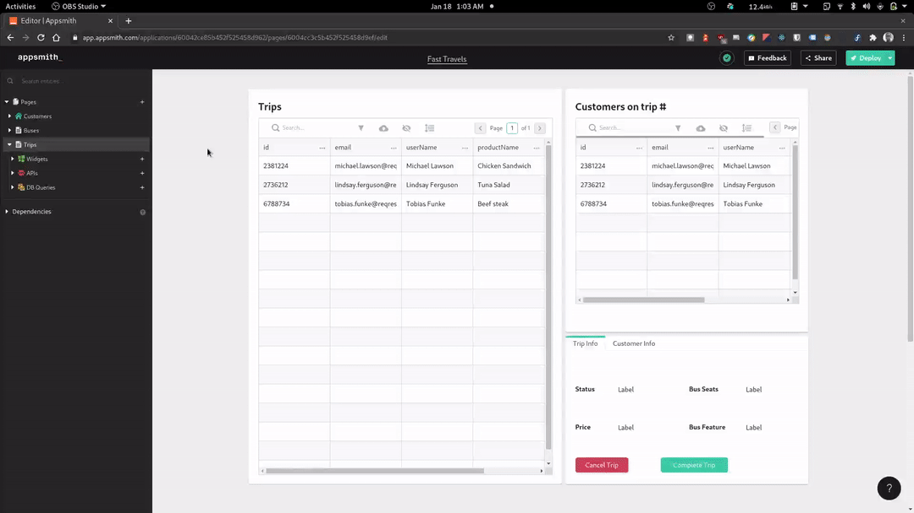
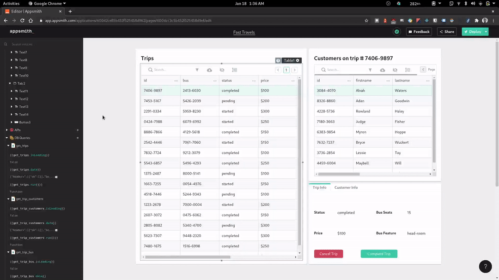
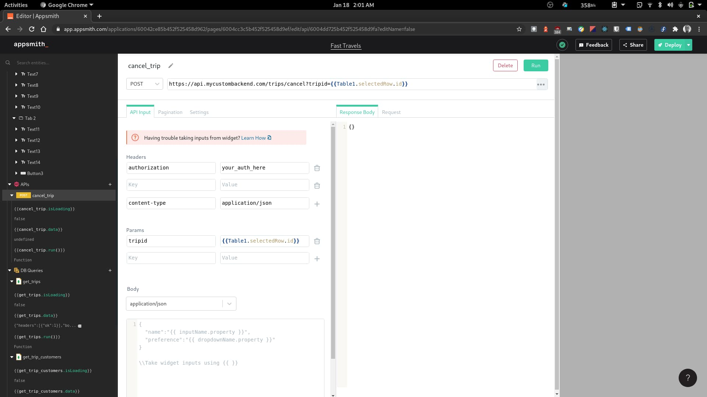

In this last section we are going add a page to manage trips. So go ahead an make a page called 'Trips'. The UI will be quite simple. It will contain a paginated table showing all trips, a table showing customers on a selected trip and a tab showing both trp info and customer info and also refund and cancel buttons



As you may have noticed, we are making use of two new widgets: the container widget and tab widget. The container widget allows us to group several widgets together. It is also useful for creating titled segments on a page as we did above. Next, we have the tab widget that similarly let's us group several components together into tabs. The beauty of this widget is that we can neatly hide components that are not needed in the moment as only the selected tab is visible.

Now, let's connect data to our tables. We'd need a query to get trips, one to get the bus assigned, and another to get the customers on a particular trip. Let's name our query to get trips `get_trips` and it should look like this.

```json
{
  "find": "trips",
  "skip": {{(Table1.pageNo - 1)*17}},
  "limit":  17
}
```

We would call the query to get the bus assigned to a trip `get_trip_bus` and it should look like this

```json
{
  "find": "busses",
  "filter": {
    "id": "{{ Table1.selectedRow.bus }}"
  },
  "limit": 1
}
```

And lastly the query to get all the customers on a trip, called `get_trip_customers` should be

```json
{
  "find": "customers",
  "filter": {
    "trip": "{{Table1.selectedRow.id}}"
  },
  "limit": 10
}
```
Now let's go back to our widgets and feed them the data. The trips table should be linked with data from the `get_trips` query. Server-side pagination should be enabled and the query should be re-run onPageChange. We should make sure that the `get_trip_customers` query is run 'onRowSelected' and the `get_trip_bus` query is run 'onSuccess'. Then let's go ahead to link to customers table to the data from `get_trip_customers` query, and do the same for the other widgets with their respective data source.

Our Trips dashboard will work as shown below.



