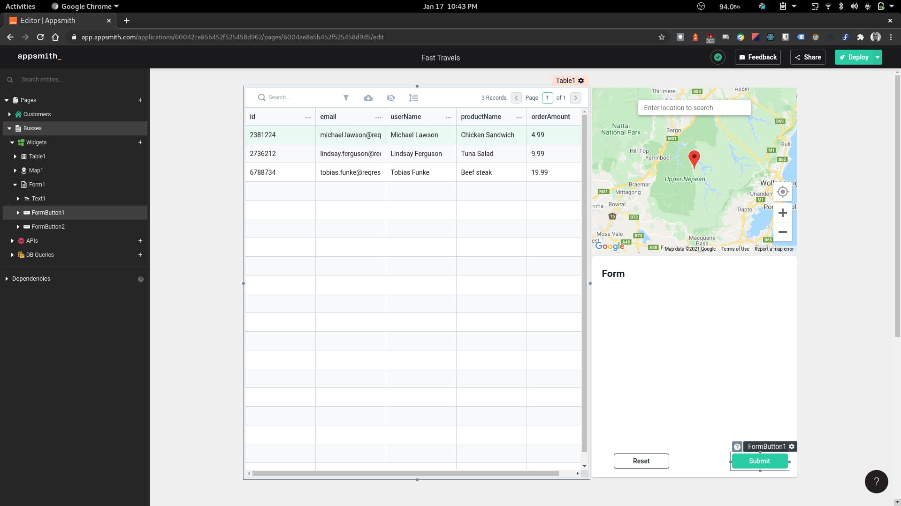
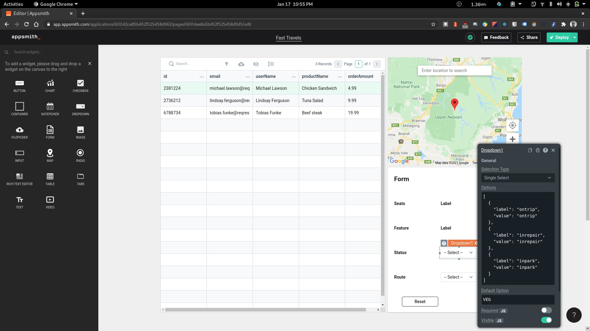
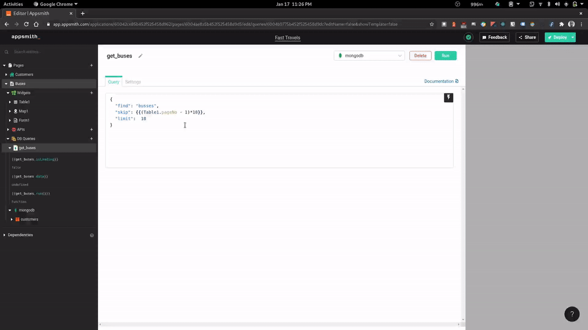

In this article we would be picking up from where we stopped in the last. We covered a lot of the basic concepts around Appsmith in the last article, so please do check out if you haven't already.

We are going to be adding another page to our application that would display the information of the buses we have, visualize their current location and update them.

## UI setup

Appsmith has another really handy and unique feature called 'Pages', that as the name implies allows us to create multiple pages in our app. So let's go ahead and create a 'Buses' page that will house all the UI and logic that we'll need to manage a bus. To create a new page, click on the plus icon on the 'Pages' section of explorer. Rename the page to 'Buses' and then drag in the table, map and form widgets into the page. We should have something like this when done



Let us go ahead and add text labels and dropdowns to our form like we did previously on the customers page by using the text and dropdown widget. The dropdown widget allows us to pass in an array of items that would be shown as selectable options. We are now going to update our labels and the dropdowns accordingly as shown below.



And now we have a basic UI completed.

## Pulling Data

We need to need to update the table with actual bus data. To do this, let's head off to the 'DB Queries' section on the explorer and create a get buses. Let's call this query `get_buses`. Appsmith allows us to do server-side pagination on tables which makes it very easy to display large dataset in small chunks. To set this up we will need to add a skip property to our query and make a dynamic offset using the tables page number as shown below. Then link the data to the table and enable server-side pagination on the table.

```json
{
  "find": "buses",
  "skip": {{(Table1.pageNo - 1)*18}},
  "limit":  18
}
```



Next let's setup the map to display the current location of the selected bus on the table. To do this, we set the 'Initial location' and 'Default markers' section of the map widget to be the longitude and latitude of the currently selected row on the table and then let Appsmith do the magic!


Selecting a row automatically updates the map widget. Sweet!

## Updating a Bus

The last thing we want to do is to update the status and route of a bus. To make this work, we need to write an `update_bus` query that would get data from the form and make the updates accordingly when the Update button is clicked. Here's a sample update query

```json
{
  "update": "buses",
  "updates": [
    {
      "q": {
        "id": "{{Table1.selectedRow.id}}"
      },
      "u": {
        "$set": {
          "status": "{{ Dropdown1.selectedOptionValue }}",
          "route": "{{ Dropdown2.selectedOptionValue }}"
        }
      }
    }
  ]
}
```

Now let's see everything in action


